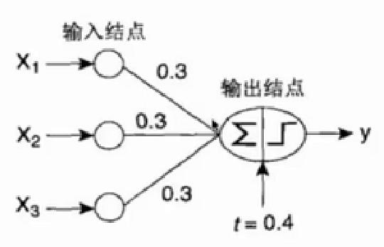

## 神经网络
#### 人工神经网络发展历史

- 19世纪末期，美国心理学家William James的《心理学原理》提出两个观点：
>1. 联想记忆（假如两个大脑的细胞曾经被一起激活过，其中有一个受到刺激被激活时，另一个也会被激活）。
>2. 神经细胞的激活是周边细胞激活影响发生叠加的效果。
- 1943年，精神病学家和神经元解剖学家McCulloch和数学家Pitts发表了文章：提出了神经元的数学描述和结构。
>1. 神经元遵循“全或无”原则。（兴奋、抑制）单层感知器
>2. M-P模型：证明只要有足够的简单神经元，在这些神经元相互连接并同步运行的情况下，可以模拟任何计算函数。
- 1949年，生理学家Hebb出版了《行为组织学》，描述了神经元权值的Hebb调整规则。
>1. 引入了“学习假说”，两个神经元之间重复激活，将使其连接权值加强。（人会记忆的原因）
>2. 提出“连接主义”。（通过不同的连接反映不同的场景建立不同的神经网络模型）
- 1957年，Rosenblatt提出了(单层)感知器。
>Widrow和Hoff引入了最小均方误差准则(LMS)
- 1969年，Minsky和Papert指出了单层感知器存在致命的缺陷，简单的神经网络只能运用于线性问题的的求解，对于非线性的问题，甚至是简单的抑或问题都无法解决。

---
- 1982年，美国物理学家Hopfield提出了Hopfield神经网络模型(反馈)
- 1986年，Rumelhart,Hinton(玻尔兹曼机速度慢，受限玻尔兹曼机),Williams发展了BP神经网络(多层感知器的误差反向传播算法)

#### 人类神经系统原理

- 轴突：尽量延伸神经细胞所跨越的距离
- 树突：跟其他神经元的轴突连接，形成电流的回路（轴轴突触，轴树突触）
- 突触：神经元连接的地方，有一定的电阻，决定了流过两个神经元间的电流强度，并形成回路

---
- 信号从树突传入，形成信号的总和，信号汇总到细胞体，细胞体对信号做一个非限制性的转变（激活函数），后通过轴突传给下一个细胞

#### 人工神经网络（ANN）

- 仿生学数学模型
- 统一的模型框架

#### 神经元仿生：单层感知器

- 输入结点
- 输出结点
- 权向量
- 偏置因子（冲量）
- 激活函数
- 学习率η
[实例](./单层感知器.docx)